<!-- @format -->

# ragtext

# Analisi Teorica e Architetturale

## 1. Introduzione

ragtext (Retrieval-Augmented Prompt-based Client-side Engine) è un'applicazione web che implementa un'innovativa tecnica di **Retrieval-Augmented Generation (RAG)** interamente lato client. A differenza delle architetture RAG tradizionali, che si affidano a moduli separati per il recupero dell'informazione (spesso basati su database vettoriali) e per la generazione del testo, ragtext utilizza un **singolo Large Language Model (LLM)** per orchestrare l'intero processo.

L'intelligenza del sistema risiede in una sofisticata catena di prompt ingegnerizzati per guidare l'LLM attraverso le diverse fasi del processo, dall'analisi dei documenti sorgente fino alla generazione della risposta finale.

## 2. Modello Teorico: RAG Prompt-Driven

Il paradigma RAG classico prevede due macro-fasi:

1.  **Retriever**: Un sistema specializzato (es. un motore di ricerca su indici vettoriali) che recupera i documenti o i passaggi più pertinenti a una data domanda da una vasta base di conoscenza.
2.  **Generator**: Un LLM che riceve la domanda e i documenti recuperati per generare una risposta informata.

ragtext sovverte questo modello a favore di un approccio unificato e sequenziale, guidato esclusivamente da prompt. L'intero processo può essere descritto come segue:

1.  **Fase di Estrazione (Extraction)**: L'LLM analizza i documenti forniti, estraendo informazioni strutturate secondo schemi predefiniti (`templates`) e istruzioni specifiche per la tipologia di documento (`docType`).
2.  **Fase di Unificazione (Unification)**: Le informazioni strutturate, estratte dai vari documenti (o dai chunk di un singolo documento), vengono aggregate e fuse dall'LLM in un'unica, coerente e de-duplicata base di conoscenza (`Knowledge Base`).
3.  **Fase di Estrazione del Contesto (Context Extraction)**: Quando l'utente pone una domanda, l'LLM viene nuovamente interrogato. Il suo compito è analizzare l'intera `Knowledge Base` e la domanda per estrarre un sottoinsieme di informazioni altamente pertinenti, che costituiscono il `Contesto`.
4.  **Fase di Generazione della Risposta (Answer Generation)**: Infine, l'LLM riceve il `Contesto` appena creato e la cronologia della conversazione per formulare una risposta naturale, precisa e contestualizzata.

### Vantaggi e Svantaggi

- **Vantaggi**:

  - **Semplicità Architetturale**: L'assenza di un database vettoriale e di un'infrastruttura di indicizzazione riduce la complessità e i costi.
  - **Client-Side**: L'intera applicazione opera nel browser, garantendo la privacy dei dati dell'utente e non richiedendo un backend dedicato.
  - **Flessibilità**: L'approccio basato sui prompt permette di modificare e adattare il comportamento del sistema con grande agilità, semplicemente cambiando le istruzioni fornite all'LLM.

- **Svantaggi**:
  - **Efficienza del Recupero**: L'LLM, pur essendo potente, potrebbe non eguagliare la precisione e la velocità di un sistema di recupero specializzato (come la ricerca vettoriale) su basi di conoscenza molto ampie.
  - **Costo Computazionale**: Ogni domanda richiede almeno due passaggi complessi (estrazione contesto e generazione risposta), potenzialmente aumentando la latenza e i costi legati alle chiamate API.

## 3. Architettura Software

ragtext è un'applicazione Vanilla JavaScript modulare. I componenti software chiave riflettono il flusso teorico descritto.

```mermaid
flowchart TD
    A[Input Utente: Documenti] --> B{1. Estrazione};
    B --> C[Chunking dei Documenti];
    C --> D[LLM: Applica `extractionPrompt`];
    D --> E{2. Unificazione};
    E --> F[LLM: Applica `unificationPrompt`];
    F --> G[(Knowledge Base)];

    H[Input Utente: Domanda] --> I{3. Estrazione Contesto};
    I -- Query + Knowledge Base --> J[LLM: Applica `extractorPrompt`];
    J --> K[(Contesto)];

    K -- Contesto + Cronologia --> L{4. Generazione Risposta};
    L --> M[LLM: Applica `answerPrompt`];
    M --> N[Output: Risposta];

    subgraph "Fase 1 & 2: Creazione Knowledge Base"
        A
        B
        C
        D
        E
        F
        G
    end

    subgraph "Fase 3 & 4: Conversazione"
        H
        I
        J
        K
        L
        M
        N
    end
```

### Componenti Chiave

- **`rag_engine.js`**: È il cuore dell'applicazione. Orchestra l'intero flusso RAG, gestendo le varie fasi, dalla creazione della `Knowledge Base` alla conversazione.

- **Prompting System (`prompts.js`, `llm_instructions.js`, `llm_templates.js`)**: Questo insieme di moduli costituisce il "cervello" del sistema.

  - `llm_instructions.js`: Definisce i criteri di estrazione specifici per ogni `docType` (es. normativo, procedurale, analitico).
  - `llm_templates.js`: Fornisce i formati di output strutturati che l'LLM deve seguire, garantendo risposte parsabili.
  - `prompts.js`: Assembla dinamicamente i prompt complessi per ogni fase del processo, combinando istruzioni, template e dati.

- **Adapter Layer (`/js/adapter/`)**: Implementa il design pattern Adapter per disaccoppiare l'applicazione dai provider LLM. Ogni adapter (es. `adapter_gemini.js`, `adapter_mistral.js`) traduce il payload generico dell'applicazione nel formato specifico richiesto dall'API del provider e ne parsifica la risposta. `HttpLlmClient.js` gestisce la logica della chiamata HTTP, inclusi timeout e cancellazione.

- **Persistence Layer (`idb_mgr.js`, `uadb.js`)**: Gestisce la persistenza dei dati nel browser.

  - `uadb.js`: Un semplice wrapper per `localStorage`, utilizzato per configurazioni leggere (tema, provider selezionato).
  - `idb_mgr.js`: Un wrapper basato sulla libreria `idb-keyval` per `IndexedDB`, usato per memorizzare dati complessi e di grandi dimensioni come la `Knowledge Base`, il `Contesto` e la cronologia delle conversazioni.

- **State Management (`BuildStateMgr.js`)**: Rende il processo di creazione della `Knowledge Base`, potenzialmente lungo e soggetto a interruzioni, completamente **resumibile**. Salva lo stato di avanzamento (documento e chunk corrente) in `IndexedDB`, permettendo di riprendere l'elaborazione esattamente da dove si era interrotta.

- **UI Layer (`app_ui.js`, `uawindow.js`, `uadialog.js`)**: Gestisce l'interfaccia utente, l'interazione con l'utente e la visualizzazione dei dati, utilizzando un sistema di finestre e dialoghi personalizzato.

---

## 4. Guida Rapida: Scenari di Utilizzo

Questa guida mostra come usare ragtext in tre scenari principali.

### Scenario 1: Inizio da Zero

Parti dai tuoi documenti per creare una nuova Base di Conoscenza e iniziare una conversazione.

1.  **Carica Documenti**: Usa **"Documenti di esempio"** dal menu o **"Upload file"** per caricare i tuoi file.
2.  **Crea Base di Conoscenza**: Clicca il pulsante **(1)** per analizzare i documenti e creare la _Knowledge Base_. Al termine, puoi salvarla usando il menu **Base di Conoscenza > Archivia**.
3.  **Crea Contesto**: Scrivi una domanda specifica nel campo di input e clicca il pulsante **(2)**. Questo estrae le informazioni pertinenti dalla Knowledge Base e crea un _Contesto_.
4.  **Conversa**: Fai la stessa domanda (o una simile) e premi **Invio** (o il pulsante **(3)**) per avviare la conversazione basata sul Contesto appena creato.

### Scenario 2: Inizio da una Base di Conoscenza Esistente

Usa una _Knowledge Base_ che hai già salvato per iniziare una nuova indagine, senza ri-analizzare i documenti.

1.  **Carica Base di Conoscenza**:
    - Vai nel menu laterale a **Base di Conoscenza > Elenco**.
    - Trova la base dati che ti interessa e clicca su **"Carica"**.
2.  **Crea Contesto**: Scrivi una **nuova domanda** nel campo di input e clicca il pulsante **(2)** per creare un nuovo _Contesto_ specifico per questa domanda.
3.  **Conversa**: Premi **Invio** (o il pulsante **(3)**) per avviare la conversazione.

### Scenario 3: Inizio da un Contesto Esistente

Riprendi una conversazione precedente partendo da un _Contesto_ che hai già salvato.

1.  **Carica Contesto**:
    - Vai nel menu laterale a **Contesto > Elenco**.
    - Trova il contesto che ti interessa e clicca su **"Carica"**.
2.  **Continua la Conversazione**: Scrivi una domanda di approfondimento nel campo di input e premi **Invio** (o il pulsante **(3)**) per continuare la conversazione associata a quel contesto.
